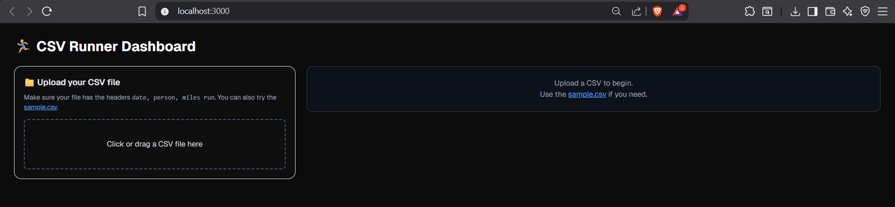
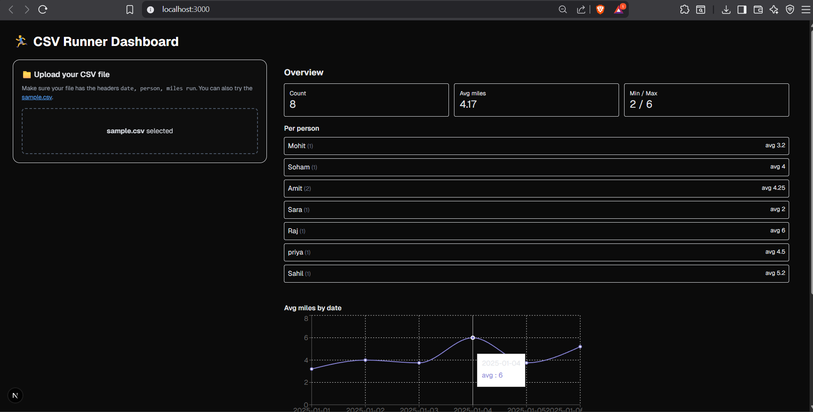
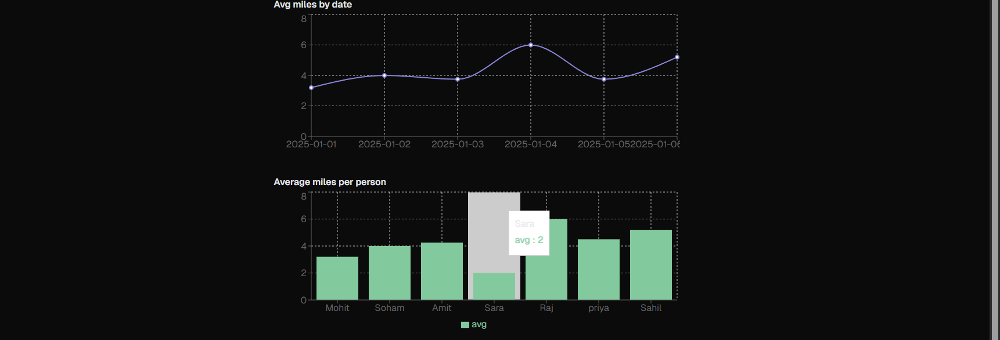

# 🏃‍♂️ CSV Runner Dashboard  
_A project by **Mohit Jeswani** for the Full Stack Development Internship Assignment (Daynt Tech Services LLP)._

---

## 📘 1. Project Overview
The **CSV Runner Dashboard** is a Next.js + Tailwind web application that allows users to upload a CSV file containing daily running data (`date, person, miles run`).

It automatically parses the data, validates structure, and generates analytics including overall and per-person performance metrics. The results are displayed with visually engaging charts powered by **Recharts**.

---

## ✨ Key Features
- 📂 **CSV Upload & Validation:** Detects missing headers and invalid data  
- 📊 **Dynamic Statistics:** Average, Min, Max, and Entry Count  
- 👥 **Per-Person Analysis:** Individual performance breakdowns  
- 📈 **Interactive Charts:** Line chart (trend over dates) & bar chart (avg per person)  
- 🧱 **Client-Side Only:** No backend or database needed  
- 🎨 **Polished Dark UI:** Clean, readable, and mobile-friendly interface  

---

## ⚙️ 2. Assumptions
- CSV headers must include: `date`, `person`, and `miles run` (case-insensitive)
- Dates can be in ISO or standard formats parseable by `Date()`
- `miles run` must be numeric
- All data handled **in-memory** — no backend or local DB  
- Application built for **Next.js 14** with **TypeScript + Tailwind**

---

## 🖼️ 6. Screenshots (Execution)

### 🔸 Default View (Before Upload)

### 🔸 After Uploading CSV

### 🔸 Analytics View (Charts)


---

## 🧰 3. Prerequisites
| Tool | Version |
|------|----------|
| Node.js | v22.14.0 |
| npm | v10.9.0 |
| Database | None (client-side only) |

---

## 🧱 4. Setup

### Clone the repository
```bash
git clone https://github.com/mohitjeswani/csv-runner-dashboard.git
cd csv-runner-dashboard
npm install
npm run dev
